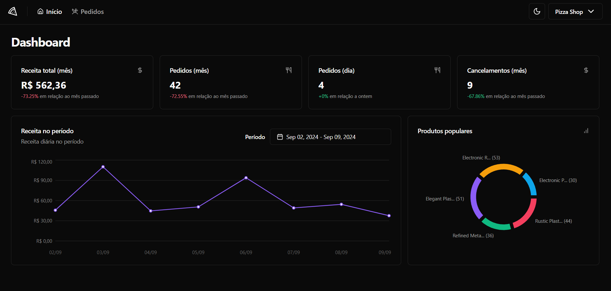

# Pizza Shop 🍕

<p align="center">
  <a href="#-layout">Layout</a> •
  <a href="#-technologies">Technologies</a> •
  <a href="#-getting-started">Getting started</a> •
  <a href="#-license">License</a>
</p>

<p align="center">
  
</p>

<!-- ## 🔖 Layout -->

## 🚀 Technologies and Concepts

- [Vite](vite.dev)
- [TypeScript](https://www.typescriptlang.org/)
- [shadcn/ui](https://ui.shadcn.com)
- [React Query](https://tanstack.com/query/latest)
- [Recharts](https://recharts.org/en-US/)
- [Vitest](https://vitest.dev/)
- [Playwright](https://playwright.dev/)
- [Mock Service Work](https://mswjs.io/)


## 💻 Getting started

### Requirements

- [Node.js](https://nodejs.org/en/)
- [pnpm](https://pnpm.io)

**Clone the project and access the folder**

```bash
git clone https://github.com/luancardosoti/ignite-reactjs-04-pizza-shop.git && cd pizza-shop
```

**Follow the steps below**

```bash
# Install the dependencies
$ pnpm i

# Run project
$ pnpm run dev
```

## 📝 License

This project is licensed under the MIT License - see the [LICENSE](LICENSE) file for details.

---

<p align="center">
  Made